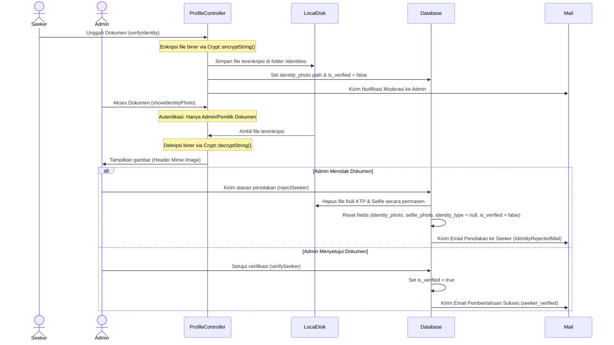

# Laporan Audit & Pemetaan Arsitektur Sistem Mataram Stay v2

Dokumen ini menyajikan hasil pemindaian mendalam, analisis arsitektur, dan pemetaan alur kerja (workflow) backend Mataram Stay pasca-perombakan sistem terbaru (Request to Book, Monetisasi Breakdown, Enkripsi KTP, dan Otomatisasi Scheduler).

---

## 1. Analisis Database & Model (State Management)

### A. Skema Tabel Utama

#### Tabel `users`
Tabel ini merekam data autentikasi dan status verifikasi pengguna. Kolom-kolom kunci terkait state management meliputi:
*   `role`: Menyimpan hak akses pengguna (`admin`, `owner`, `seeker`).
*   `is_verified` (boolean): Menandakan status verifikasi identitas KTP seeker oleh Administrator.
*   `identity_type` (string, nullable): Jenis dokumen identitas yang diunggah (`ktp`, `sim`, `passport`).
*   `identity_photo` & `selfie_photo` (string, nullable): Path lokasi penyimpanan file identitas terenkripsi.
*   `phone_verified_at` & `email_verified_at` (timestamp, nullable): Menyimpan waktu penyelesaian verifikasi OTP.

#### Tabel `bookings`
Tabel ini mengelola siklus transaksi sewa kamar kos. Kolom-kolom kunci meliputi:
*   `status`: State sewa utama dengan nilai:
    *   `Pending`: Booking telah dibuat, menunggu persetujuan Owner (untuk booking baru) atau menunggu pembayaran.
    *   `Active`: Booking aktif dan berjalan (penyewa sudah menempati kamar). Setel setelah pembayaran sukses.
    *   `Cancelled`: Dibatalkan (bisa karena ditolak Owner, kadaluwarsa Midtrans, auto-cancel scheduler, atau overbooking).
    *   `Completed`: Masa sewa telah selesai secara sukses.
*   `payment_status`: State pembayaran dengan nilai:
    *   `Unpaid`: Belum dibayar.
    *   `Paid`: Pembayaran lunas terverifikasi.
    *   `Pending`: Proses pembayaran Midtrans sedang berjalan (misal virtual account dikeluarkan tapi belum dibayar).
    *   `Expired` / `Failed`: Batas waktu pembayaran habis atau transaksi ditolak.
*   `is_approved` (boolean): Menandakan status persetujuan dari Pemilik Kos (Owner). default: `false`.

### B. Matriks Transisi State & Interaksi Booking

Alur interaksi dinamis antara `status`, `payment_status`, dan `is_approved` digambarkan dalam tabel di bawah ini:

| Kondisi Sistem / Aksi | `is_approved` | `status` | `payment_status` | Keterangan & Tindakan Sistem |
| :--- | :---: | :---: | :---: | :--- |
| **Booking Baru Dibuat** | `false` | `Pending` | `Unpaid` | Pesanan tersimpan di database. Snap Token Midtrans **ditangguhkan** (tidak dibuat). |
| **Ditolak oleh Owner** | `false` | `Cancelled` | `Unpaid` | Pesanan batal. Mengirim email notifikasi penolakan ke Seeker. |
| **Disetujui oleh Owner** | `true` | `Pending` | `Unpaid` | Seeker diizinkan membayar. Snap Token Midtrans digenerate saat halaman detail booking dibuka. |
| **Pembayaran Sukses (Midtrans)** | `true` | `Active` | `Paid` | Transaksi selesai. Kamar kos didecrement (`available_rooms - 1`). Email sukses dikirim. |
| **Midtrans Expire / Cancel** | `true` | `Cancelled` | `Unpaid` | Booking dibatalkan otomatis. Jika sebelumnya berstatus `Active`, kapasitas kamar dipulihkan (`available_rooms + 1`). |
| **Auto-Cancel Scheduler** | `false` / `true` | `Cancelled` | `Unpaid` | Pembersihan harian untuk booking berumur > 7 hari tanpa pelunasan. |
| **Sewa Selesai** | `true` | `Completed` | `Paid` | Masa tinggal berakhir. |

---

## 2. Alur Verifikasi Identitas (End-to-End)

Proses verifikasi identitas (KTP/SIM/Paspor) dirancang dengan standar keamanan tinggi (enkripsi biner) guna mematuhi privasi data pengguna.

### Sinkronisasi & Cleanup Berkas pada Penolakan (`rejectSeeker`):
Saat Admin menolak identitas:
1.  Sistem melakukan pengecekan nama file pada kolom `identity_photo` dan `selfie_photo`.
2.  File biner yang terenkripsi dihapus secara fisik dari disk privat `'local'`: `Storage::disk('local')->delete(...)`.
3.  Kolom di database diset kembali ke `null` (`identity_type`, `identity_photo`, `selfie_photo`) dan `is_verified` diset ke `false`. Hal ini memastikan tidak ada data sampah di server (cleanup) dan menghindarkan kebocoran data.

---

## 3. Mekanisme Verifikasi Akun & OTP

Mataram Stay mengintegrasikan sistem autentikasi ganda: Pendaftaran reguler berbasis email dan Pendaftaran Sosial menggunakan Google SSO.

### A. Alur Google SSO (Social OAuth)
*   **Pemberian Status Verifikasi Otomatis**: Saat pengguna mendaftar atau masuk menggunakan Google SSO (`GoogleAuthController.php`), email mereka divalidasi langsung oleh Google.
*   Oleh karena itu, sistem secara otomatis mengisi kolom `email_verified_at` dengan waktu saat ini (`now()`) tanpa menuntut pengguna melakukan verifikasi OTP email secara manual.

### B. Alur Email Reguler & OTP
*   Sistem menggunakan 4 digit angka acak (`rand(1000, 9999)`) yang disimpan sementara di Session dengan masa kadaluwarsa 10 menit (`email_otp_expires_at`).
*   **Alur Rate Limiting OTP**:
    *   Menggunakan Laravel `RateLimiter` dengan throttle key berbasis kombinasi User ID dan IP Address (`send-otp:user_id|ip_address`).
    *   Batas percobaan ditetapkan maksimal **3 kali permintaan OTP** dalam periode waktu **15 menit**.
    *   Bila melebihi batas (rate limit terlampaui), server mengembalikan response JSON HTTP 429 ("Terlalu banyak permintaan OTP. Silakan coba lagi dalam X menit.") guna menangkal serangan brute-force / spamming email.

---

## 4. Monetisasi & Pencatatan Transaksi

Sistem memiliki pembagian komponen keuangan terperinci untuk menjamin transparansi bagi Pemilik Kos (Owner) dan keuntungan platform.

### A. Parameter & Rumus Perhitungan Biaya
Biaya-biaya di bawah ini dihitung berdasarkan konfigurasi dinamis yang diambil dari database (`settings` table):
1.  **`room_subtotal`** = `price_per_month` $\times$ `duration_months`
2.  **`admin_fee`** = Konfigurasi `admin_fee` (default: Rp 2.500)
3.  **`commission_fee`** = Persentase `commission_rate` (default: 5%) dari `room_subtotal`, dibulatkan: `round(room_subtotal * (commission_rate / 100))`
4.  **`net_owner_amount`** = Pendapatan bersih pemilik kos: `room_subtotal - commission_fee`
5.  **`total_price`** = Total tagihan akhir penyewa: `room_subtotal + admin_fee`

### B. Waktu Penghitungan (Kapan Biaya Dihitung?)
*   Biaya-biaya ini dihitung secara instan **ketika pesanan pertama kali dibuat** (`BookingController@store` atau command `SendRentExtensionReminders`).
*   **Alasan**: Mengunci (locking) struktur harga sejak awal pesanan diajukan demi mencegah inkonsistensi data keuangan jika Admin mengubah tarif layanan (`admin_fee` atau `commission_rate`) di masa mendatang saat sewa berjalan.

### C. Integrasi Webhook Midtrans (`PaymentController@notification`)
Midtrans terintegrasi secara asinkronus menggunakan webhook:
1.  **Validasi Keamanan & Integritas**:
    *   Webhook memverifikasi parameter `signature_key` menggunakan SHA512 hash yang menggabungkan `order_id`, `status_code`, `gross_amount`, dan server key rahasia Midtrans.
    *   Memastikan `gross_amount` dari Midtrans sama persis dengan `total_price` pemesanan di database.
2.  **Penanganan Settlement & Race Condition**:
    *   Saat status pembayaran berhasil (`settlement` / `capture`), query dijalankan di dalam DB Transaction dengan penguncian baris data (`lockForUpdate()`) pada RoomType terpilih.
    *   **Pencegahan Overbooking (Kamar Kos Penuh)**:
        *   Jika kamar masih tersedia, sistem menyetel booking menjadi `Paid` & `Active`, lalu mengurangi (`decrement`) stok kamar.
        *   Jika kamar penuh sesaat sebelum pembayaran diselesaikan (terjual ke transaksi lain yang lunas lebih cepat), sistem akan memotong alur, menyetel status booking menjadi `Cancelled` (tetapi `payment_status = Paid`), dan memicu email pemberitahuan overbooking kepada Seeker serta Administrator untuk proses refund manual.
