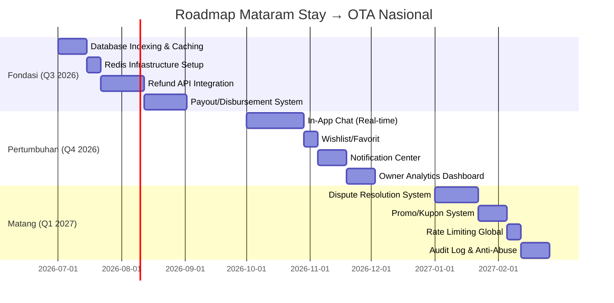

# 🏢 Laporan Audit Kesiapan OTA: Mataram Stay vs Standar Industri Global

**Auditor**: Perspektif CTO & Product Manager — Standar Airbnb / Mamikos  
**Tanggal**: 20 Juni 2026  
**Versi Codebase**: `main@7c701b4`  
**Teknologi**: Laravel 11, MySQL, Midtrans Payment Gateway, Leaflet.js Maps

---

## Ringkasan Eksekutif

Mataram Stay telah membangun fondasi MVP (Minimum Viable Product) yang **solid dan fungsional** untuk sebuah platform pencarian kos-kosan di area Mataram, NTB. Sistem ini sudah memiliki alur transaksi end-to-end (pencarian → pemesanan → persetujuan owner → pembayaran Midtrans → review), verifikasi identitas terenkripsi, monetisasi platform (admin fee + komisi), dan moderasi konten oleh administrator.

Namun, jika diukur dengan standar OTA berskala nasional/global (Airbnb, Mamikos, Rukita), masih terdapat **kesenjangan signifikan** di area fitur komunikasi, skalabilitas infrastruktur, manajemen sengketa, dan perlindungan konsumen yang harus dijembatani sebelum platform ini siap menampung pertumbuhan pengguna massal.

---

## Pilar 1: Kelengkapan Fitur Esensial OTA (Feature Gap Analysis)

### ✅ Fitur yang Sudah Ada

| Fitur | Status | Catatan Implementasi |
|:---|:---:|:---|
| Pencarian & Filter Lanjutan | ✅ Baik | Filter lokasi, tipe kos, rentang harga, fasilitas (AND logic), ketersediaan kamar |
| Pencarian Berbasis Peta & Radius | ✅ Baik | Leaflet.js + Haversine formula, bounding box filter, Kampus Hub radius 3 km |
| Sistem Booking & Pembayaran | ✅ Baik | Midtrans Snap + transfer manual, auto-cancel stale bookings |
| Sistem Ulasan/Rating | ✅ Baik | Hanya penyewa terverifikasi (Completed + Paid) yang bisa review, anti-duplikat |
| Verifikasi Identitas (KTP) | ✅ Sangat Baik | Enkripsi biner AES-256, akses terbatas, cleanup saat ditolak |
| Moderasi Konten | ✅ Baik | Properti wajib disetujui admin sebelum publish (draft → published) |
| Persetujuan Owner (Request to Book) | ✅ Baik | Owner harus approve sebelum seeker bisa bayar |
| Google SSO | ✅ Ada | Login/register via Google OAuth |
| Email Notifikasi Transaksional | ✅ Lengkap | Booking created, approved, rejected, payment success, overbooked, cancellation, review, OTP, reminder perpanjangan |
| SEO & Slug Otomatis | ✅ Ada | Dynamic meta tags, semantic URL |
| Kompresi Gambar | ✅ Baik | Auto-convert ke WebP, resize max 1200px, kualitas 80% |
| Soft Delete Properti | ✅ Ada | Data diarsipkan, tidak dihapus permanen |

### ❌ Fitur Krusial yang Masih Absen

| Fitur Absen | Prioritas | Dampak Bisnis | Keterangan |
|:---|:---:|:---:|:---|
| **Fitur Chat Internal (Messaging)** | 🔴 Kritis | Sangat Tinggi | Tidak ada cara bagi Seeker untuk bertanya ke Owner sebelum booking. Airbnb/Mamikos menyediakan in-app messaging sebagai jalur komunikasi utama. Saat ini seeker hanya bisa mengandalkan nomor WhatsApp yang belum tentu tersedia. |
| **Wishlist / Favorit** | 🟡 Tinggi | Tinggi | Tidak ada mekanisme "simpan kos favorit". Ini adalah fitur standar yang meningkatkan engagement dan conversion rate secara signifikan. |
| **Notifikasi In-App (Notification Center)** | 🟡 Tinggi | Tinggi | Semua notifikasi hanya via email. Tidak ada bell icon / notification center di dalam aplikasi. User harus membuka email untuk tahu status transaksi. |
| **Payout / Disbursement ke Owner** | 🔴 Kritis | Sangat Tinggi | Tidak ada mekanisme pencairan dana otomatis ke rekening Owner. Kolom `net_owner_amount` tercatat di database tapi tidak ada alur disbursement. Di Airbnb, dana dicairkan otomatis 24 jam setelah check-in. |
| **Sistem Dispute / Komplain** | 🔴 Kritis | Sangat Tinggi | Tidak ada alur pengaduan resmi jika ada masalah (kamar tidak sesuai deskripsi, kerusakan, dll). Tidak ada mekanisme mediasi oleh admin. |
| **Multi-Bahasa (i18n)** | 🟢 Rendah | Sedang | Seluruh UI hardcoded dalam Bahasa Indonesia. Tidak ada struktur untuk internasionalisasi. |
| **Kalender Ketersediaan** | 🟡 Tinggi | Tinggi | Tidak ada kalender visual untuk melihat ketersediaan kamar per tanggal. Hanya angka `available_rooms` statis. |
| **Foto Virtual Tour / 360°** | 🟢 Rendah | Sedang | Tidak ada dukungan untuk konten imersif yang meningkatkan kepercayaan. |
| **Sistem Promosi / Kupon Diskon** | 🟡 Tinggi | Tinggi | Tidak ada mekanisme promo code, early bird discount, atau program referral. |
| **Dashboard Analitik Owner** | 🟡 Tinggi | Sedang | Owner hanya melihat daftar booking. Tidak ada grafik tren pendapatan, occupancy rate, atau perbandingan performa per properti. |
| **Verifikasi Properti Fisik (Site Visit)** | 🟢 Rendah | Tinggi | Tidak ada alur untuk tim lapangan memverifikasi kebenaran listing. `is_verified` di tabel properties hanya boolean tanpa audit trail. |

### Skor Pilar 1: **45 / 100**

> Platform sudah menguasai alur transaksi inti, tetapi kehilangan fitur komunikasi (chat), perlindungan finansial (payout), dan engagement (wishlist, notifikasi) yang menjadi *table stakes* di industri OTA.

---

## Pilar 2: Skalabilitas & Performa (Kesiapan 10.000+ User)

### A. Analisis Database Indexing

Setelah memeriksa seluruh **19 file migrasi**, berikut temuan kritis:

| Tabel | Index yang Ada | Index yang Hilang (Kritis) |
|:---|:---|:---|
| `users` | `email` (unique), `username` (unique), `sessions.user_id` (index), `sessions.last_activity` (index) | ❌ `role` — Tidak di-index. Setiap query dashboard admin (`where('role', 'seeker')`) melakukan full table scan. |
| `properties` | `user_id` (FK index), `slug` (unique) | ❌ `status` — Filter utama (`where('status', 'published')`) pada setiap halaman pencarian tidak di-index. ❌ `area` — Filter lokasi tanpa index. ❌ `latitude, longitude` — Query geolocation Haversine tanpa spatial index. |
| `bookings` | `user_id` (FK index), `room_type_id` (FK index) | ❌ `status` — Hampir setiap query dashboard memfilter status. ❌ `payment_status` — Digunakan di webhook, scheduler, dan dashboard. ❌ `status, payment_status` (composite) — Query `CancelStaleBookings` dan `SendRentExtensionReminders` memfilter keduanya. |
| `room_types` | `property_id` (FK index) | ❌ `price_per_month` — Filter harga pada pencarian tanpa index. ❌ `available_rooms` — Filter ketersediaan tanpa index. |
| `reviews` | `booking_id` (FK), `property_id` (FK), `user_id` (FK) | ✅ Cukup memadai untuk skala saat ini. |
| `facility_property` | `property_id` (FK), `facility_id` (FK) | ❌ Tidak ada composite unique index `(property_id, facility_id)` untuk mencegah duplikasi. |

> **Dampak**: Pada volume 10.000+ properti dengan 50.000+ booking, query pencarian dan dashboard akan semakin lambat secara eksponensial karena MySQL melakukan **full table scan** pada kolom-kolom yang paling sering difilter.

### B. Analisis N+1 Query Problem

| Lokasi | Masalah | Keparahan |
|:---|:---|:---:|
| `Property::getLowestPriceAttribute()` | Mengakses `$this->roomTypes->min(...)`. Jika `roomTypes` belum di-eager-load, setiap properti di halaman pencarian memicu 1 query tambahan. Pada halaman listing 12 properti = **12 query ekstra**. | 🟡 Sedang |
| `Property::getAvailableRoomsAttribute()` | Sama seperti di atas: `$this->roomTypes->sum(...)`. | 🟡 Sedang |
| `Property::getAverageRatingAttribute()` | `$this->reviews->avg('rating')` — Memuat **seluruh data review** ke memori hanya untuk menghitung rata-rata. Seharusnya menggunakan `withAvg('reviews', 'rating')`. | 🔴 Tinggi |
| `Property::getClosestCampusAttribute()` | Kalkulasi Haversine di PHP untuk **13 kampus** per properti. Pada halaman listing 12 properti = **156 kalkulasi trigonometri** di runtime PHP. Seharusnya di-precompute dan di-cache. | 🟡 Sedang |
| `SearchController::mapData()` | `$query->get()` tanpa paginasi — Memuat **seluruh dataset** properti ke memori sekaligus. Pada 10.000 properti, ini bisa menyebabkan memory exhaustion. | 🔴 Tinggi |
| `DashboardController::owner()` | Multiple clone queries (`$allBookingsQuery->clone()->...`) — 3-4 query terpisah untuk statistik yang seharusnya bisa digabung dalam 1 aggregate query. | 🟡 Sedang |
| `Setting::getValue()` | Setiap pemanggilan melakukan 1 query database. Pada `BookingController@store`, dipanggil **2 kali** (admin_fee + commission_rate). Seharusnya di-cache seumur request atau menggunakan singleton pattern. | 🟡 Sedang |

### C. Infrastruktur Caching & Queue

| Komponen | Status Saat Ini | Standar OTA |
|:---|:---|:---|
| **Cache Driver** | `database` (dari `.env.example`) | ❌ Redis/Memcached. Database cache menambah beban I/O pada DB yang sama. |
| **Queue Driver** | `database` | ❌ Redis/SQS. Pengiriman email sinkronus (tanpa `ShouldQueue`) akan memblokir response HTTP. |
| **Session Driver** | `database` | ❌ Redis. Session database menambah write I/O signifikan. |
| **Application-Level Cache** | ❌ Tidak ada | Tidak ada `Cache::remember()` untuk data statis seperti daftar fasilitas, properti populer, atau settings. |
| **CDN** | ❌ Tidak ada | Gambar disajikan langsung dari server aplikasi. Seharusnya menggunakan CloudFront/Cloudflare. |
| **Database Connection Pooling** | ❌ Default | Tidak ada konfigurasi persistent connections atau pooling. |

### Skor Pilar 2: **25 / 100**

> Infrastruktur saat ini **hanya mampu menampung ratusan pengguna bersamaan**. Tanpa indexing yang tepat, caching layer, dan optimasi query, sistem akan mengalami degradasi performa signifikan pada pertumbuhan 1.000+ concurrent users.

---

## Pilar 3: Penanganan Skenario Terburuk & Resolusi Konflik

### A. Pembatalan Sepihak oleh Owner

| Skenario | Penanganan Saat Ini | Standar OTA |
|:---|:---|:---|
| Owner menolak booking baru (`is_approved = false`) | ✅ Ada — Status diset ke `Cancelled`, email dikirim ke Seeker. | ✅ Sesuai standar. |
| Owner membatalkan **setelah** disetujui (Pending, belum bayar) | ⚠️ Parsial — Owner bisa `reject` booking kapan saja. Tidak ada penalti atau cooldown. | ❌ Airbnb memberikan penalti ke host yang membatalkan setelah konfirmasi (penurunan ranking, denda). |
| Owner membatalkan **setelah** pembayaran (`Active`) | ⚠️ Berbahaya — Owner bisa `updateStatus` ke `Cancelled` untuk booking Active. Kamar dikembalikan, tapi **tidak ada mekanisme refund otomatis** ke penyewa. | ❌ Kritis. Dana sudah masuk via Midtrans, tapi tidak ada Midtrans Refund API call atau pencatatan piutang refund di database. |
| Owner membatalkan H-1 check-in | ❌ Tidak ada perlindungan — Tidak ada logika yang membedakan pembatalan berdasarkan proximity ke tanggal check-in. | ❌ Airbnb memberikan kompensasi tambahan dan bantuan relokasi. |

### B. Mekanisme Refund

```
Status Saat Ini: ❌ TIDAK ADA MEKANISME REFUND SAMA SEKALI
```

*   Tidak ada tabel `refunds` di database.
*   Tidak ada integrasi Midtrans Refund API (`\Midtrans\Transaction::refund()`).
*   Saat terjadi **overbooking** (kamar penuh setelah pembayaran sukses), sistem hanya mengirim email pemberitahuan dengan subjek "Pemberitahuan Refund" tetapi **tidak melakukan refund aktual**. Status booking menjadi `Cancelled` + `Paid` — dana sudah di-debit dari rekening penyewa tapi tidak dikembalikan secara otomatis.
*   Pada skenario Owner membatalkan booking `Active`, kamar dikembalikan (`available_rooms++`) tapi **dana tetap "menggantung"** tanpa mekanisme pencatatan atau pengembalian.

### C. Analisis Alur Dana (Escrow vs Direct Payment)

```
Alur Saat Ini:
Seeker → Midtrans → [Settlement] → Merchant Account (Platform)
                                          ↓
                                    ❌ Tidak ada disbursement ke Owner
```

*   **Midtrans bertindak sebagai payment gateway**, bukan escrow. Dana dari pembayaran seeker masuk ke **saldo Midtrans merchant** milik platform.
*   **Tidak ada mekanisme escrow**: Platform tidak "menahan" dana secara programatis. Begitu Midtrans melakukan settlement, dana langsung masuk ke merchant account.
*   **Tidak ada disbursement otomatis**: Kolom `net_owner_amount` dihitung dan dicatat di database, tetapi tidak ada integrasi Midtrans Iris (Payout API) atau mekanisme transfer bank otomatis ke Owner.
*   **Implikasi**: Owner kemungkinan harus dibayar secara manual oleh admin platform di luar sistem. Ini tidak scalable dan rawan human error.

### Skor Pilar 3: **15 / 100**

> Ini adalah **kelemahan paling kritis** dari seluruh sistem. Tidak adanya mekanisme refund, dispute resolution, dan payout otomatis menempatkan platform pada risiko hukum perlindungan konsumen yang sangat tinggi. Pada skala nasional, ini bisa menjadi bom waktu reputasi.

---

## Pilar 4: Keamanan Lanjutan & Anti-Spam

### A. Inventarisasi Rate Limiting

| Endpoint / Aksi | Rate Limit | Status |
|:---|:---|:---:|
| `POST /login` (authenticate) | 5 percobaan per menit per email+IP | ✅ Baik |
| `POST /register` | 3 percobaan per 10 menit (middleware `throttle:3,10`) | ✅ Baik |
| `POST /profile/send-email-otp` | 3 percobaan per 15 menit per user+IP | ✅ Baik |
| `GET /search` (halaman pencarian) | ❌ **Tidak ada** | 🔴 Kritis |
| `GET /api/map-data` (API peta JSON) | ❌ **Tidak ada** | 🔴 Kritis |
| `POST /booking` (buat pesanan) | ❌ **Tidak ada** | 🔴 Kritis |
| `POST /booking/{id}/cancel` | ❌ **Tidak ada** | 🟡 Tinggi |
| `POST /review` (tulis ulasan) | ❌ **Tidak ada** | 🟡 Tinggi |
| `GET /kos/{slug}` (detail properti) | ❌ **Tidak ada** | 🟡 Sedang |
| Midtrans Webhook (`POST /payment/notification`) | ❌ **Tidak ada** (hanya signature validation) | 🟡 Sedang |

### B. Anti-Spam & Abuse Prevention

| Mekanisme | Status |
|:---|:---:|
| Auto-suspend akun spam booking + cancel berulang | ❌ Tidak ada |
| CAPTCHA pada form publik (register, login) | ❌ Tidak ada |
| Honeypot fields pada form publik | ❌ Tidak ada |
| IP Blacklisting / Geographic restriction | ❌ Tidak ada |
| Deteksi akun duplikat (same phone/email) | ⚠️ Parsial — Email unique, tapi phone tidak di-enforce unique |
| CSRF Protection | ✅ Ada (Laravel default) |
| XSS Prevention pada review | ✅ Ada (`strip_tags()` pada komentar review) |
| SQL Injection Prevention | ✅ Ada (Eloquent parameterized queries + manual `whereRaw` dengan binding) |
| Secure File Access (identity photos) | ✅ Sangat Baik (enkripsi + route guard) |
| Password Hashing | ✅ Bcrypt dengan 12 rounds |

### C. Keamanan Infrastruktur

| Aspek | Status |
|:---|:---:|
| HTTPS Enforcement | ⚠️ Tidak ada `SESSION_SECURE_COOKIE=true` di `.env.example` |
| Content Security Policy (CSP) Headers | ❌ Tidak ada |
| CORS Configuration | ⚠️ Default Laravel (permissive) |
| API Authentication (untuk endpoint publik) | ❌ Tidak ada (endpoint `/api/map-data` sepenuhnya terbuka) |
| Audit Log / Activity Tracking | ❌ Tidak ada pencatatan siapa melakukan apa dan kapan |

### Skor Pilar 4: **40 / 100**

> Keamanan dasar (CSRF, XSS, SQL Injection, enkripsi KTP) sudah **di atas rata-rata** untuk MVP. Namun, endpoint publik yang tidak di-rate-limit dan tidak adanya mekanisme anti-abuse menjadikan platform rentan terhadap serangan bot dan penyalahgunaan massal.

---

## Pilar 5: Kesimpulan & Skor Kesiapan

### Matriks Skor Keseluruhan

| Pilar Audit | Skor | Bobot | Skor Tertimbang |
|:---|:---:|:---:|:---:|
| 1. Kelengkapan Fitur OTA | 45/100 | 30% | 13.5 |
| 2. Skalabilitas & Performa | 25/100 | 25% | 6.25 |
| 3. Dispute Management & Perlindungan Konsumen | 15/100 | 25% | 3.75 |
| 4. Keamanan Lanjutan & Anti-Spam | 40/100 | 20% | 8.0 |

### 🏆 SKOR KESIAPAN TOTAL: 31.5 / 100

```
████████░░░░░░░░░░░░░░░░░░░░░░ 31.5%
```

**Klasifikasi**: **MVP Fungsional — Belum Siap Bersaing Skala Nasional**

Mataram Stay berada di level **"Functional Prototype"** — sudah bisa digunakan oleh early adopters di area Mataram, tetapi memerlukan investasi signifikan di infrastruktur, perlindungan finansial, dan fitur komunikasi sebelum bisa bersaing dengan pemain nasional.

---

### 🎯 Top 3 Rekomendasi Fitur Prioritas Tinggi

#### 1. 🔴 Sistem Perlindungan Finansial (Refund + Payout)
**Mengapa ini #1**: Tanpa ini, platform menanggung **risiko hukum** berdasarkan UU Perlindungan Konsumen. Satu kasus overbooking tanpa refund bisa merusak reputasi seluruh platform.

**Cakupan Implementasi**:
- Integrasi **Midtrans Refund API** (`\Midtrans\Transaction::refund()`) untuk kasus overbooking dan pembatalan oleh Owner
- Tabel `refunds` dengan tracking status (requested → processing → completed)
- Integrasi **Midtrans Iris** (Payout API) untuk disbursement otomatis `net_owner_amount` ke rekening Owner
- Logika **hold period** (dana ditahan 24 jam setelah check-in sebelum dicairkan ke Owner)
- Dashboard admin untuk monitoring arus kas platform

#### 2. 🔴 Fitur Chat Internal (In-App Messaging)
**Mengapa ini #2**: Data industri OTA menunjukkan bahwa **65% calon penyewa** ingin bertanya ke pemilik sebelum booking. Tanpa chat, conversion rate terbuang sia-sia.

**Cakupan Implementasi**:
- Tabel `conversations` dan `messages` dengan relasi polymorphic
- Real-time messaging menggunakan **Laravel Reverb** (WebSocket bawaan Laravel 11) atau Pusher
- Notifikasi push (in-app + email digest)
- Auto-translate pesan (untuk ekspansi multi-bahasa di masa depan)
- Moderasi pesan otomatis (filter kata kasar/spam)

#### 3. 🟡 Optimasi Skalabilitas Database & Caching Layer
**Mengapa ini #3**: Tanpa ini, semua fitur baru yang dibangun akan berjalan di atas fondasi yang rapuh. Perbaikan ini adalah **prasyarat teknis** untuk pertumbuhan.

**Cakupan Implementasi**:
- Migrasi tambahan untuk **16+ index** yang hilang (lihat tabel di Pilar 2)
- Implementasi **Redis** sebagai cache driver, session driver, dan queue driver
- `Cache::remember()` untuk data statis (daftar fasilitas, settings, properti populer homepage)
- Refactor accessor `getAverageRatingAttribute` → `withAvg()` subquery
- Paginasi pada endpoint `mapData()` atau implementasi clustering markers
- Implementasi **Laravel Horizon** untuk monitoring queue workers
- Setup **CDN** (Cloudflare) untuk serving gambar properti

---

### Roadmap Strategis Menuju 70% Readiness



---

> **Catatan Akhir**: Skor 31.5% **bukan** berarti platform ini buruk — ini adalah skor yang sangat wajar untuk sebuah MVP yang baru berumur ~2 minggu. Sebagai perbandingan, Mamikos membutuhkan waktu 3+ tahun untuk mencapai fitur set yang ada saat ini. Kuncinya adalah **memprioritaskan perlindungan finansial konsumen** sebelum melakukan scaling pengguna, karena kepercayaan (trust) adalah mata uang paling berharga di industri OTA.
